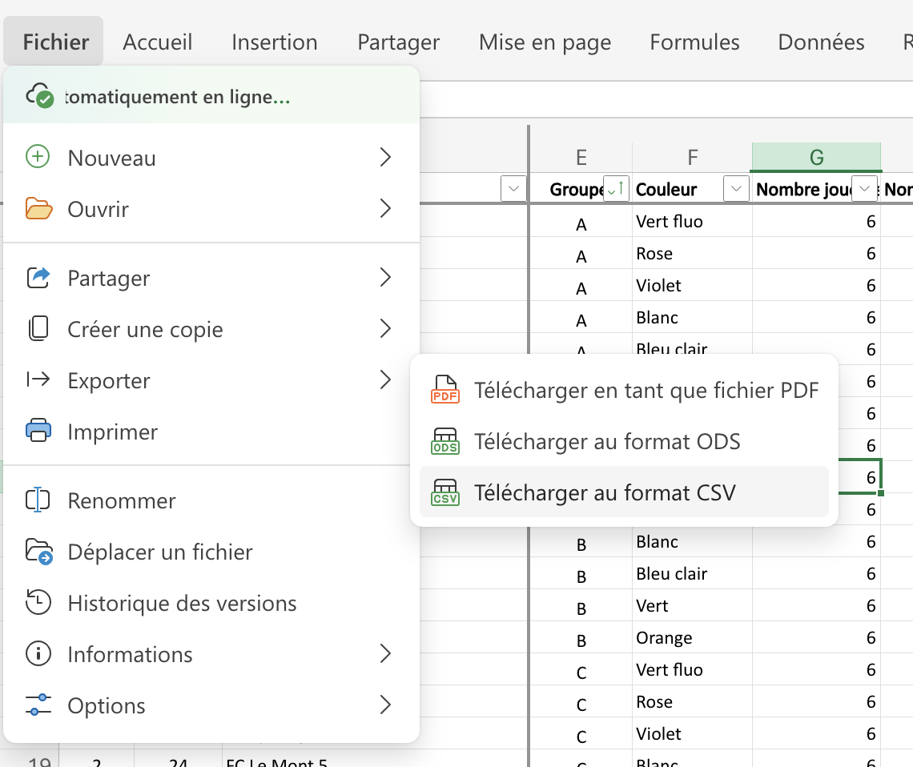

# Usage

### 1. Download the CSV file from Graines de foot's Excel database



### 2. Run the script

```bash
npm run start
```

### 3. Specify tournament category

Example: `Jun. E`

### 4. Specify the CSV file path

Example: `/Users/John/Downloads/Graines de foot - Feuille 1.csv`

### 5. Done !

You will find the generated files in the `results` folder.
